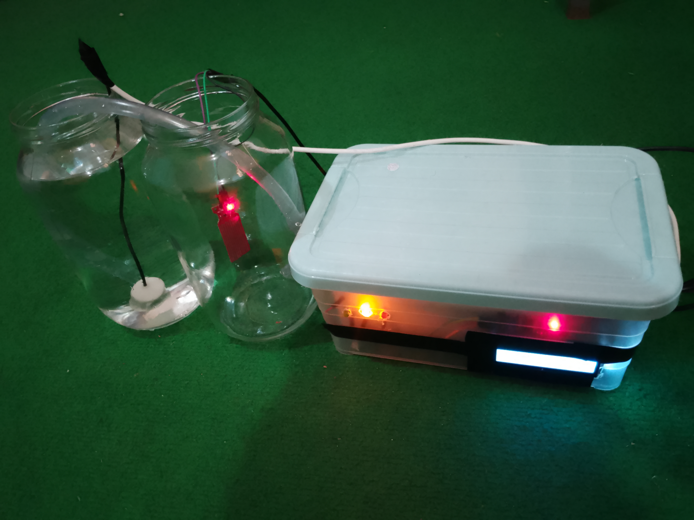
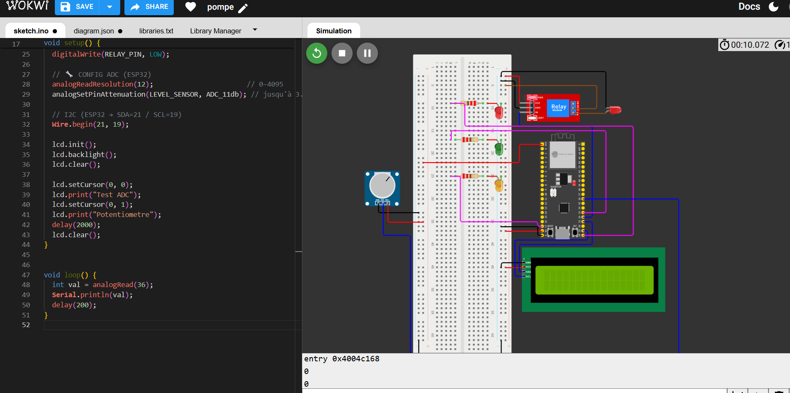

# Automatic Water Pump Control System using ESP32

## Overview

This project implements an automatic water pump control system based on the ESP32 microcontroller.

The system monitors the water level using a water level sensor and automatically controls a 5V water pump through a relay module.

A Bluetooth Android application was developed using MIT App Inventor to allow remote monitoring and manual control of the pump.

## Features

* Automatic pump control
* Manual pump control via Bluetooth
* Real-time water level monitoring
* LCD display for system status
* Water level indication using LEDs
* Android mobile application

## Hardware Components

* ESP32 Development Board
* Water Level Sensor
* 5V Water Pump
* 1-Channel Relay Module
* LCD 16x2 I2C Display
* LEDs and Resistors
* Power Supply

## System Operation

The ESP32 continuously reads the water level sensor.

* If the water level is below the lower threshold, the pump is activated.
* If the water level reaches the upper threshold, the pump is stopped.
* The user can also switch to manual mode using the Bluetooth application.

## Project Images

### Real Prototype

### Wokwi Simulation

### Android Application

## Author

Benjamin Kpoka

Embedded Systems Engineering Student
